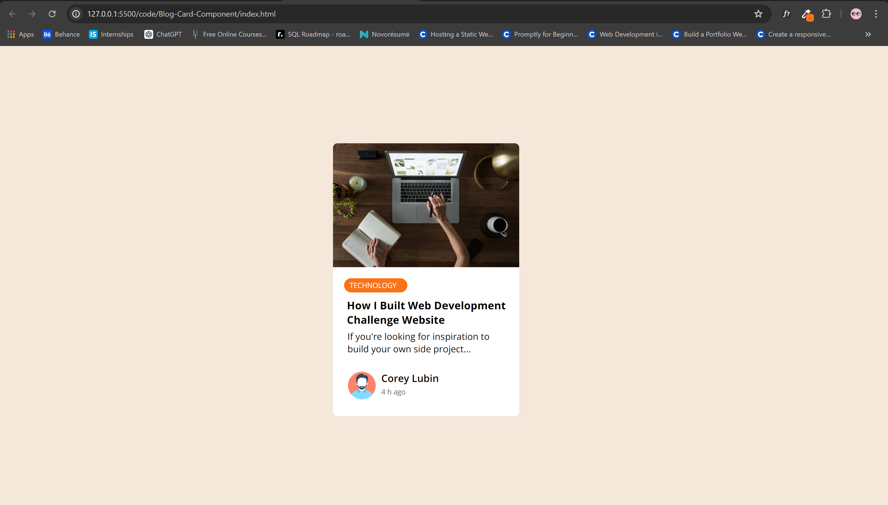

# Blog Card Component


This repository contains the code for a Blog Card Component, which is a responsive and interactive UI element designed to showcase a blog post with an image, title, category, description, and user details. This project is inspired by a challenge provided by [FrontendPro](https://www.frontendpro.dev/frontend-coding-challenges/blog-card-component-bBI5CtACFbEmwqF4LHJU).

## Demo



## Features

- **Responsive Design**: The card is designed to be fully responsive and adjusts gracefully across different screen sizes.
- **Hover Effect**: The card elevates and casts a shadow on hover, providing a subtle interaction effect.
- **Category Tag**: The category of the blog is prominently displayed at the top with a distinctive background color.
- **User Details**: Displays the author's profile image, name, and the time since the blog was posted.

## Technologies Used

- **HTML5**: For the structure of the component.
- **CSS3**: For styling the component, including responsive design and hover effects.
- **Google Fonts**: The card uses the "Open Sans" and "Roboto" fonts to enhance the typography.

## How to Use

1. Clone the repository:
   ```bash
   git clone https://gitlab.com/Yashi-Singh-9/blog-card-component.git
   ```
2. Navigate to the project directory:
   ```bash
   cd blog-card-component
   ```
3. Open `index.html` in your browser to view the Blog Card Component.

## Credits

This project is based on the Blog Card Component challenge from [FrontendPro](https://www.frontendpro.dev/frontend-coding-challenges/blog-card-component-bBI5CtACFbEmwqF4LHJU). Special thanks to them for providing the challenge and inspiration.

## License

This project is licensed under the MIT License. See the [LICENSE](MIT LICENSE) file for more details.
